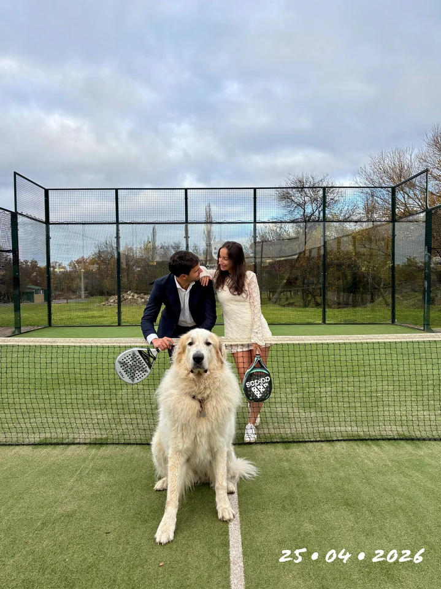

<!--
    GUÍA DE COMENTARIOS PARA index.html
    
    Este documento explica la estructura y propósito de cada sección
    del archivo index.html de la invitación digital.
    
    ÍNDICE DE SECCIONES:
    1. DOCTYPE y estructura básica
    2. HEAD: Metadatos y configuración
    3. BODY: Estructura de la página
    4. Secciones principales (home, bride, timeline, gallery, etc.)
    5. Atributos data-* para configuración dinámica
-->

<!-- ============================================================================
     ESTRUCTURA GENERAL DEL ARCHIVO
     ============================================================================ -->

<!doctype html>
<!-- 
    ATRIBUTOS IMPORTANTES:
    - lang="es": Idioma de la página (español)
    - data-bs-theme="auto": Tema automático según preferencia del navegador
      Valores: 'auto' (automático), 'light' (claro), 'dark' (oscuro)
-->
<html lang="es" data-bs-theme="auto">

<head>
    <!-- ================================================================
         SECCIÓN 1: METADATOS COMUNES
         ================================================================ -->
    
    <!-- Codificación de caracteres (UTF-8 = soporta todos los idiomas) -->
    <meta charset="utf-8">
    
    <!-- 
        VIEWPORT: Configura cómo se ve en dispositivos móviles
        width=device-width: Ancho igual al dispositivo
        initial-scale=1: Sin zoom inicial
    -->
    <meta name="viewport" content="width=device-width, initial-scale=1">
    
    <!-- Título de la página que aparece en la pestaña del navegador -->
    <title>Wedding Invitation - Mercedes y Pablo | 25 de abril de 2026</title>

    <!-- ================================================================
         SECCIÓN 2: METADATOS SEO (Motores de búsqueda)
         ================================================================ -->
    
    <!-- Autor de la página -->
    <meta name="author" content="Mercedes y Pablo">
    
    <!-- Idioma principal -->
    <meta name="language" content="es">
    
    <!-- Indicaciones a buscadores -->
    <meta name="robots" content="index, follow, max-image-preview:large">
    <meta name="googlebot" content="index, follow, max-image-preview:large">
    
    <!-- Información general -->
    <meta name="title" content="Wedding Invitation - Mercedes y Pablo">
    <meta name="description" content="Nos da mucho gusto invitarte a nuestra boda. Mercedes y Pablo - 25 de abril de 2026">
    <meta name="keywords" content="boda, invitación, wedding, digital, 2026">

    <!-- ================================================================
         SECCIÓN 3: METADATOS OPEN GRAPH (Redes sociales)
         ================================================================
         Estos datos se usan cuando se comparte en Facebook, WhatsApp, etc.
    -->
    
    <!-- Título que aparece al compartir -->
    <meta property="og:title" content="Wedding Invitation - Mercedes y Pablo">
    
    <!-- Descripción que aparece al compartir -->
    <meta property="og:description" content="Nos da mucho gusto invitarte a nuestra boda. Mercedes y Pablo - 25 de abril de 2026">
    
    <!-- Palabras clave para compartir -->
    <meta property="og:keywords" content="boda, invitación, wedding">
    
    <!-- 
        Imagen que aparece al compartir
        IMPORTANTE: Debe ser WEBP (no JPEG)
        Resolución recomendada: 1200x630 píxeles
    -->
    <meta property="og:image" content="./assets/images/std.webp">
    <meta property="og:image:secure_url" content="./assets/images/std.webp">
    <meta property="og:image:type" content="image/webp">
    <meta property="og:image:alt" content="Mercedes y Pablo - Invitación de boda">
    <meta property="og:image:width" content="980">
    <meta property="og:image:height" content="980">
    
    <!-- Tipo de contenido -->
    <meta property="og:type" content="website">
    
    <!-- Localización (idioma_país) -->
    <meta property="og:locale" content="es_ES">
    
    <!-- URL de la página -->
    <meta property="og:url" content="https://pablovicentem.github.io/Boda-Mercedes-y-Pablo/">
    
    <!-- Nombre del sitio -->
    <meta property="og:site_name" content="Wedding Invitation - Mercedes y Pablo">

    <!-- ================================================================
         SECCIÓN 4: APARIENCIA Y TEMA
         ================================================================ -->
    
    <!-- Permite instalar como aplicación en dispositivos móviles -->
    <meta name="mobile-web-app-capable" content="yes">
    
    <!-- Título cuando se instala como app -->
    <meta name="apple-mobile-web-app-title" content="Mercedes y Pablo - Boda">
    
    <!-- Color del tema en navegadores Android -->
    <meta name="theme-color" content="#000000">
    
    <!-- Permite tema oscuro y claro -->
    <meta name="color-scheme" content="dark light">
    
    <!-- Barra de estado en iOS (black-translucent = negra transparente) -->
    <meta name="apple-mobile-web-app-status-bar-style" content="black-translucent">
    
    <!-- URL canónica (para evitar contenido duplicado en SEO) -->
    <link rel="canonical" href="https://pablovicentem.github.io/Boda-Mercedes-y-Pablo/">
    
    <!-- 
        FAVICON Y ÍCONO DE APP
        Favicon: Ícono en la pestaña del navegador
        Apple touch icon: Ícono cuando se guarda en Home de iOS
    -->
    <link rel="icon" type="image/webp" sizes="192x192" href="./assets/images/dylan.webp">
    <link rel="apple-touch-icon" sizes="192x192" href="./assets/images/dylan.webp">

    <!-- ================================================================
         SECCIÓN 5: PRECONEXIONES A CDN (Optimización de carga)
         ================================================================
         Estos enlaces permiten conexiones más rápidas a servicios externos
    -->
    
    <!-- Búsqueda previa de DNS (faster DNS lookup) -->
    <link rel="dns-prefetch" href="https://cdn.jsdelivr.net">
    <link rel="dns-prefetch" href="https://fonts.googleapis.com">
    <link rel="dns-prefetch" href="https://fonts.gstatic.com">
    
    <!-- Preconectar para abrir conexión TCP/TLS -->
    <link rel="preconnect" href="https://cdn.jsdelivr.net" crossorigin="anonymous">
    <link rel="preconnect" href="https://fonts.googleapis.com" crossorigin="anonymous">
    <link rel="preconnect" href="https://fonts.gstatic.com" crossorigin="anonymous">

    <!-- ================================================================
         SECCIÓN 6: PRECARGAR RECURSOS CRÍTICOS
         ================================================================
         Cargar recursos importantes ANTES de necesitarlos
    -->
    
    <!-- Fuente Google Fonts -->
    <link rel="preload" href="https://fonts.googleapis.com/css2?family=Josefin+Sans&display=swap" as="style">
    
    <!-- Framework Bootstrap CSS -->
    <link rel="preload" href="https://cdn.jsdelivr.net/npm/bootstrap@5.3.8/dist/css/bootstrap.min.css" integrity="sha256-2FMn2Zx6PuH5tdBQDRNwrOo60ts5wWPC9R8jK67b3t4=" crossorigin="anonymous" as="style">
    
    <!-- Iconos FontAwesome -->
    <link rel="preload" href="https://cdn.jsdelivr.net/npm/@fortawesome/fontawesome-free@7.1.0/css/all.min.css" integrity="sha256-4rTIfo5GQTi/7UJqoyUJQKzxW8VN/YBH31+Cy+vTZj4=" crossorigin="anonymous" as="style">
    
    <!-- Bootstrap JavaScript (necesario para componentes interactivos) -->
    <link rel="preload" href="https://cdn.jsdelivr.net/npm/bootstrap@5.3.8/dist/js/bootstrap.bundle.min.js" integrity="sha256-5P1JGBOIxI7FBAvT/mb1fCnI5n/NhQKzNUuW7Hq0fMc=" crossorigin="anonymous" as="script">

    <!-- ================================================================
         SECCIÓN 7: TIPOGRAFÍA (Google Fonts)
         ================================================================
         Fuente elegante para títulos: "Josefin Sans"
    -->
    <link rel="stylesheet" href="https://fonts.googleapis.com/css2?family=Josefin+Sans&display=swap">

    <!-- ================================================================
         SECCIÓN 8: ESTILOS CSS (Hojas de estilo)
         ================================================================
         Orden: Externas → Personalizadas
    -->
    
    <!-- Bootstrap 5: Framework CSS para layout responsive -->
    <link rel="stylesheet" href="https://cdn.jsdelivr.net/npm/bootstrap@5.3.8/dist/css/bootstrap.min.css" integrity="sha256-2FMn2Zx6PuH5tdBQDRNwrOo60ts5wWPC9R8jK67b3t4=" crossorigin="anonymous">
    
    <!-- FontAwesome: Librería de iconos -->
    <link rel="stylesheet" href="https://cdn.jsdelivr.net/npm/@fortawesome/fontawesome-free@7.1.0/css/all.min.css" integrity="sha256-4rTIfo5GQTi/7UJqoyUJQKzxW8VN/YBH31+Cy+vTZj4=" crossorigin="anonymous">
    
    <!-- Estilos personalizados para invitados -->
    <link rel="stylesheet" href="./css/guest.css">
    
    <!-- Tema sunset (colores, gradientes, animaciones) -->
    <link rel="stylesheet" href="./css/sunset-theme.css">

    <!-- ================================================================
         SECCIÓN 9: SCRIPTS JAVASCRIPT
         ================================================================
         Atributo 'defer': Los scripts se cargan DESPUÉS del HTML
         Esto evita bloquear la carga de la página
    -->
    
    <!-- Bootstrap JavaScript: Componentes interactivos (modales, etc.) -->
    
    
    <!-- Inicializa las diapositivas con imágenes desde images.json -->
    
    
    <!-- Carga imágenes solo cuando entran en pantalla (lazy loading) -->
    
    
    <!-- Punto de entrada principal de la aplicación -->
    

</head>

<!-- ================================================================
     SECCIÓN 10: BODY (Cuerpo de la página)
     ================================================================
     ATRIBUTOS IMPORTANTES:
     
     - data-audio: URL de la música de fondo
       Ejemplo: "./assets/music/Concerning Hobbits.mp3"
       Cambiar a "" (vacío) para deshabilitar
     
     - data-time: Fecha y hora de la boda
       Formato: YYYY-MM-DD HH:MM:SS
       Ejemplo: "2026-04-25 18:00:00"
       Esto calcula el contador regresivo
     
     - data-confetti: true/false
       true = mostrar confeti al confirmar asistencia
       false = deshabilitar confeti
     
     - data-key: Clave para comentarios (dejar vacío si no lo usas)
     
     - data-url: URL de API para comentarios (dejar vacío si no lo usas)
-->

<body data-key="" data-url="" data-audio="./assets/music/Concerning Hobbits.mp3" data-confetti="true" data-time="2026-04-25 18:00:00">

    <!-- 
        CONTENEDOR RAÍZ (Root Container)
        - clase "opacity-0": Invisible al inicio (CSS la muestra cuando carga)
        - id "root": Punto de referencia para CSS y JavaScript
    -->
    

        <!-- ============================================================
             VISTA DE ESCRITORIO (Desktop view) - OCULTA
             Mostrada solo en pantallas grandes (responsive)
             Nota: Está oculta (d-none) para mostrar solo en móvil
             ============================================================ -->
        

            <!-- Contenedor para slideshow de imágenes -->
            

                <!-- Las diapositivas se insertan aquí dinámicamente -->
                

                    <!-- slideshow-init.js inserta elementos aquí -->
                    

                        <!-- Slides generadas por JavaScript -->
                    

                

                <!-- Título superpuesto en el slideshow -->
                

                    <h2 class="font-esthetic mb-4" style="font-size: 2rem;">Mercedes &amp; Pablo</h2>
                    
Sábado, 25 de abril de 2026

                

            

        

        <!-- ============================================================
             VISTA DE MÓVIL (Mobile view) - VISIBLE EN TODOS LOS DISPOSITIVOS
             Contiene todas las secciones principales de la invitación
             ============================================================ -->
        

            <!-- 
                MAIN CONTENT
                data-bs-spy="scroll": Detecta sección actual al scroll
                tabindex="0": Accesibilidad (puede recibir foco)
            -->
            <main data-bs-spy="scroll" data-bs-target="#navbar-menu" data-bs-root-margin="25% 0% 0% 0%" data-bs-smooth-scroll="true" tabindex="0">

                <!-- ====================================================
                     SECCIÓN: HOME (Portada)
                     - Imagen de fondo
                     - Título "Mercedes & Pablo"
                     - Contador regresivo (días, horas, minutos)
                     - Botón para desplazarse hacia abajo
                     ==================================================== -->
                <section id="home" class="bg-light-dark position-relative overflow-hidden p-0 m-0" role="region" aria-label="Inicio">
                    <!-- 
                        IMAGEN DE FONDO
                        - src: imagen placeholder (carga rápido)
                        - data-src: imagen real (se carga con lazy loading)
                        - loading="lazy": No cargar hasta que sea visible
                    -->
                    

                    <!-- CONTENIDO PRINCIPAL: Título, imagen de perfil, contador -->
                    

                        
                        <!-- Imagen de perfil de la pareja (circular) -->
                        

                        <!-- Título principal -->
                        <h2 class="font-esthetic mb-2" style="font-size: clamp(2rem, 8vw, 2.5rem); color: #ffffff; text-shadow: 3px 3px 6px rgba(0, 0, 0, 0.5);">
                            Mercedes &amp; Pablo
                        </h2>

                        <!-- Fecha de la boda -->
                        

                            Sábado, 25 de abril de 2026
                        

                        <!-- 
                            CONTADOR REGRESIVO (Countdown)
                            Los valores (días, horas, minutos) se actualizan con JavaScript
                            IDs usados en guest.js:
                            - id="day": Muestra el número de días
                            - id="hour": Muestra el número de horas
                            - id="minute": Muestra el número de minutos
                        -->
                        

                            

                                <!-- DÍAS -->
                                

                                    
0

                                    <small style="font-size: 0.9rem; color: rgba(255, 255, 255, 0.9);">Días</small>
                                

                                <!-- HORAS -->
                                

                                    
0

                                    <small style="font-size: 0.9rem; color: rgba(255, 255, 255, 0.9);">Horas</small>
                                

                                <!-- MINUTOS -->
                                

                                    
0

                                    <small style="font-size: 0.9rem; color: rgba(255, 255, 255, 0.9);">Min</small>
                                

                            

                        

                        <!-- Botón para desplazarse hacia abajo -->
                        <a href="#bride" class="mt-2 d-inline-block" style="color: #ffffff; text-decoration: none;">
                            <i class="fa-solid fa-chevron-down" style="animation: bounce 2s infinite;"></i>
                        </a>
                    

                </section>

                <!-- 
                    NOTA SOBRE LAS SIGUIENTES SECCIONES:
                    
                    Cada sección tiene una estructura similar:
                    1. <section id="..."> - Contenedor con ID único
                    2. Atributo role="region" - Accesibilidad
                    3. aria-label="..." - Descripción para lectores de pantalla
                    4. Contenido específico (imágenes, texto, formularios, etc.)
                    
                    Las secciones principales incluyen:
                    - BRIDE (Nosotros): Fotos y descripción de la pareja
                    - TIMELINE (Cronograma): Horarios y eventos
                    - GALLERY (Galería): Fotos de la pareja
                    - RSVP (Confirmación): Formulario para confirmar asistencia
                    - etc.
                -->

            </main>
        

    

    <!-- ================================================================
         FOOTER Y SCRIPTS ADICIONALES (si los hay)
         ================================================================ -->

</body>

</html>

<!-- ====================================================================
     GUÍA RÁPIDA: CÓMO PERSONALIZAR index.html
     ==================================================================== -->

<!--
1. CAMBIAR LA FECHA DE LA BODA:
   Busca: <body data-time="2026-04-25 18:00:00">
   Cambia a: <body data-time="YYYY-MM-DD HH:MM:SS">
   Ejemplo: <body data-time="2026-06-15 19:30:00">

2. CAMBIAR LA MÚSICA:
   Busca: data-audio="./assets/music/Concerning Hobbits.mp3"
   Cambia a: data-audio="./assets/music/tunueva.mp3"
   Nota: El archivo debe estar en ./assets/music/

3. CAMBIAR IMÁGENES:
   - En atributos data-src: cambiar la ruta
   - Asegúrate que la imagen sea .webp (no .jpeg)
   - Ejemplo: data-src="./assets/images/nuevaimagen.webp"

4. CAMBIAR TEMA (Oscuro/Claro):
   Busca: <html lang="es" data-bs-theme="auto">
   Opciones:
   - "auto": Detecta preferencia del navegador
   - "light": Siempre claro
   - "dark": Siempre oscuro

5. DESABILITAR CONFETI:
   Busca: data-confetti="true"
   Cambia a: data-confetti="false"

6. DESABILITAR MÚSICA:
   Busca: data-audio="./assets/music/..."
   Cambia a: data-audio=""

7. CAMBIAR TÍTULOS Y TEXTOS:
   - Busca el texto entre <h1>, <h2>, 
 tags
   - Cámbialo con el nuevo texto
   - Mantén la estructura HTML igual
-->
